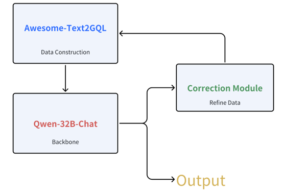
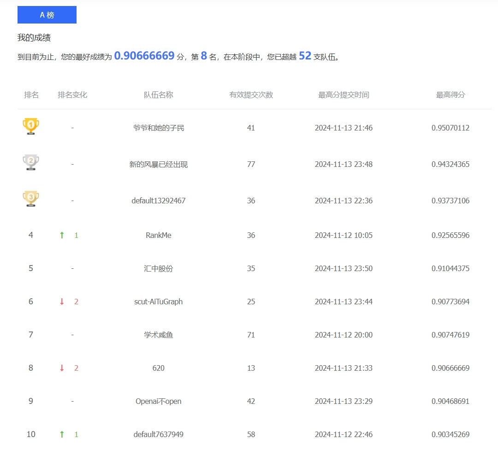

## Overview

This project aims to generate GQL (Graph Query Language) queries using a combination of **LoRA fine-tuning** and **in-context learning** techniques. It enhances the performance of pre-trained models on specific tasks by integrating an innovative error-correction mechanism, leveraging syntax detection modules to ensure that the generated queries comply with GQL syntax. This README provides detailed instructions on how to set up and run the project.

---
## Visualizations
### Model Structure
The diagram below illustrates the structure of our model, showcasing how LoRA fine-tuning, in-context learning, and the syntax detection module are integrated to generate accurate GQL queries.



### Preliminary Round Results
The following graph highlights our performance in the preliminary round, where our innovative approach and error-correction mechanisms secured a competitive ranking.



## Instructions

### Environment Setup
1. **Install Required Dependencies and Pre-trained Models**
   - Run the `install.sh` script to configure the required environment and download the necessary pre-trained models:
     ```bash
     bash install.sh
     ```

2. **Run the Program**
   - Use the `run.sh` script to execute the model and generate results:
     ```bash
     bash run.sh
     ```

---

## Key Components

### 1. LoRA Fine-Tuning
- **What is LoRA?**
  - LoRA (Low-Rank Adaptation) introduces lightweight, trainable low-rank matrices to adapt pre-trained models for new tasks.
  - Instead of updating all model parameters, LoRA fine-tunes only the low-rank matrices, significantly reducing computational cost.

- **Training Approach:**
  - The pre-trained model's parameters remain frozen during fine-tuning.
  - Only the low-rank matrices are trained, ensuring efficient adaptation to new tasks while maintaining original model knowledge.

---

### 2. In-Context Learning
- **Data Augmentation:**
  - The model uses in-context learning to enhance the limited training dataset.
  - During training, random data pairs are used where one serves as a reference context for generating GQL queries.

- **Similarity-Based Context Selection:**
  - A similarity threshold of **0.8** ensures that only the top 5 most relevant data points are selected for context.
  - This improves the model's ability to learn from highly related examples.

---

### 3. Syntax Detection and Error Correction
- **Antr4 Syntax Module:**
  - Integrated to validate the GQL syntax of generated queries.
  - Queries with syntax errors are marked invalid.

- **JW Distance Similarity Detection:**
  - JW (Jaro-Winkler) distance measures the similarity between the generated and target queries.
  - It ensures minor errors and syntax variations are handled effectively.

- **Error-Correction Mechanism:**
  - A loop-based mechanism continuously corrects syntax errors in the generated queries until they are error-free.

---

## Performance Considerations
1. **Efficiency:**
   - LoRA fine-tuning reduces the computational cost compared to full model fine-tuning.
   - Context selection enhances learning with limited training data.

2. **Error-Free Queries:**
   - Syntax validation ensures all outputs meet GQL syntax standards, reducing errors and improving overall quality.

---

## Summary
This project successfully combines cutting-edge techniques like LoRA fine-tuning, in-context learning, and error correction to optimize GQL query generation. The methodology addresses challenges like limited data and syntax errors, resulting in high-quality outputs and superior performance.
